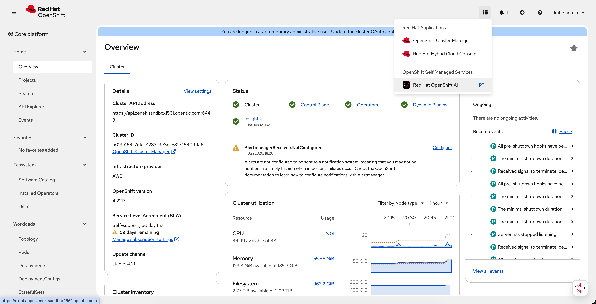
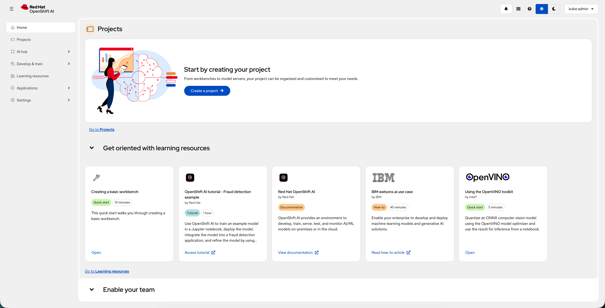

# 🛠️ Guide to Configuring RHOAI for Model Deployment

[](https://www.openshift.com)
[](LICENSE)


## Purpose

The purpose of this guide is to offer the simplest steps for configuring Red Hat OpenShift AI (RHOAI) for model deployment.
RHOAI does not come properly configured for GPU use and model deployment out of the box after installing the operator.
This guide will give you the steps needed to do so, as well as offer insight into why each step is necessary for model deployment. This guide focuses on preparing for deploying models using the vLLM ServingRuntime for KServe.

Required Operators:
- ***Node Feature Discovery (NFD) Operator:*** Detects and labels nodes based on hardware capabilities for proper AI workload scheduling.
- ***NVIDIA GPU Operator:*** Automates deployment of GPU drivers, CUDA libraries, and dependencies for AI workloads.
- ***OpenShift Service Mesh Operator:*** Provides Istio for managing secure communication between model-serving components.
- ***Red Hat OpenShift Serverless Operator:*** Provides Knative Serving for scalable and event-driven AI model deployment.
- ***Red Hat Authorino Operator:*** Provides authentication and authorization for secure access to AI model endpoints.
- ***OpenShift cert-manager Operator:*** Manages TLS certificates required by KServe and related components.
- ***JobSet Operator:*** Required by the RHOAI Trainer component for distributed training job management.
- ***Red Hat Connectivity Link Operator:*** Provides API gateway, authentication, rate limiting, and policy enforcement for LLMInferenceService.
- ***LeaderWorkerSet Operator:*** Enables wide expert parallelism for multi-node LLM inference workloads.
- ***Red Hat OpenShift AI Operator:*** Manages and deploys AI components and services within OpenShift.

Environment used for:
- Deploying the ***Granite model*** on RHOAI, using ***A100 NVIDIA GPU***, served using ***vLLM ServingRuntime for KServe***
- Gathering metrics and doing benchmarking on the deployed granite models 


## 1. Enabling GPU Support

### 1.1 Install the Node Feature Discovery (NFD) Operator 

***The NFD Operator is used to detect and label nodes based on their hardware capabilities. This is important that we can properly schedule AI workloads or deploy models on GPU nodes.***

Apply the Namespace, OperatorGroup, and Subscription object

```bash
oc apply -f manifests/01/nfd-operator.yaml
```

Verify the operator is installed and running before moving on to the next step.

```bash
oc get pods -n openshift-nfd -w
```

### 1.2 Apply the NFD Instance Object 

***After installing the NFD Operator, you must apply an NFD instance object to deploy the NFD DaemonSet, which scans nodes for hardware features and labels them accordingly.*** 

```bash
oc apply -f manifests/01/nfd-instance.yaml
```

### 1.3 Install the NVIDIA GPU Operator 

***The NVIDIA GPU Operator is essential for RHOAI since it is used to automate the deployment of GPU drivers, CUDA libraries, and other dependencies required for AI workloads and model serving.***

Apply the Namespace, OperatorGroup, and Subscription object

```bash
oc apply -f manifests/01/nvidia-gpu-operator.yaml
```

Verify the operator is installed and running before moving on to the next step.

### 1.4 Apply NVIDIA GPU ClusterPolicy 

***The NVIDIA GPU Operator itself only installs the operator framework, but doesn't automaticaly deploy the necessary components. We need to apply the ClusterPolicy as that is what enables and configures GPU support within the cluster.***

Create the ClusterPolicy. Following command lets you retrieve example ClusterPolicy from installed operator.

```bash
oc get csv \
 -n nvidia-gpu-operator \
 -l operators.coreos.com/gpu-operator-certified.nvidia-gpu-operator \
 -ojsonpath='{.items[0].metadata.annotations.alm-examples}' | \
jq '.[0]' > scratch/nvidia-gpu-clusterpolicy.json
```

Apply the ClusterPolicy

```bash
oc apply -f scratch/nvidia-gpu-clusterpolicy.json
```

### 1.5 (OPTIONAL) Running a Sample GPU Workload

In order to test if GPU support is now enabled correctly in your cluster, we can run a simple GPU workload. 

Create new namespace to run GPU workload

```bash
oc project sandbox || oc new-project sandbox
```

Create and run the GPU workload

```bash
oc apply -f manifests/01/nvidia-gpu-sample-app.yaml
```

Check the logs to see the output of the workload

```bash
oc logs cuda-vectoradd
```

If your GPU enabled nodes are configured correctly you shoud see an output as follows:

```
[Vector addition of 50000 elements]
Copy input data from the host memory to the CUDA device
CUDA kernel launch with 196 blocks of 256 threads
Copy output data from the CUDA device to the host memory
Test PASSED
Done
```

## 2. Install RHOAI KServe Dependencies

***KServe provides scalable and efficient model serving capabilities, enabling deployment, inference, and monitoring of AI models within OpenShift.***

### 2.1 Install the OpenShift Service Mesh Operator

***The OpenShift Service Mesh Operator is required for KServe because KServe relies on Istio for managing communication between model serving components***

Apply the Subscription object to install the operator

```bash
oc apply -f manifests/02/servicemesh-subscription.yaml
```

### 2.2 Install the Red Hat OpenShift Serverless Operator

***The Red Hat OpenShift Serverless Operator is required because it provides Knative Serving, which enables serverless capabilities that assist in model deployment.***

```bash
oc apply -f manifests/02/serverless-operator.yaml
```

### 2.3 Install the Red Hat Authorino Operator

***The Red Hat Authorino Operator is required because it provides authentication for API requests, ensuring secure access to AI model endpoints.***

```bash
oc apply -f manifests/02/authorino-subscription.yaml
```

### 2.4 Install the OpenShift cert-manager Operator

***cert-manager is required by KServe and related components to manage TLS certificates automatically. Without it, LLMInferenceService cannot be used.***

Apply the Namespace, OperatorGroup, and Subscription object

```bash
oc apply -f manifests/02/cert-manager-operator.yaml
```

Verify the operator is installed and running before moving on.

```bash
oc get pods -n cert-manager-operator -w
```

### 2.5 Install the JobSet Operator

***The JobSet Operator is required by the RHOAI Trainer component for managing distributed training jobs. Without it, the Trainer component will fail to become ready.***

Apply the Namespace, OperatorGroup, and Subscription object

```bash
oc apply -f manifests/02/jobset-operator-subscription.yaml
```

Wait for the operator to be ready, then apply the JobSetOperator instance

```bash
oc apply -f manifests/02/jobset-operator.yaml
```

### 2.6 Install the Red Hat Connectivity Link Operator

***Red Hat Connectivity Link (Kuadrant) is required to enable LLMInferenceService, providing API gateway functionality, authentication, rate limiting, and traffic policy enforcement for LLM model endpoints.***

Apply the Namespace, OperatorGroup, and Subscription object:

```bash
oc apply -f manifests/02/connectivity-link-operator.yaml
```

Verify the operator is installed and running before moving on:

```bash
oc get pods -n kuadrant-system -w
```

Once the operator is ready, enable the Kuadrant web console plugin:

```bash
oc patch console.operator.openshift.io cluster --type=json \
  -p '[{"op":"add","path":"/spec/plugins/-","value":"kuadrant-console-plugin"}]'
```

Then create the Kuadrant instance. This activates the operator and wires up its components (Authorino, Limitador, DNS Operator). Without this CR, any `AuthPolicy` resources are accepted but never enforced — Kuadrant's internal Authorino is not started and no `AuthConfig` resources are generated.

```bash
oc apply -f manifests/02/kuadrant-instance.yaml
```

Verify Kuadrant is ready:

```bash
oc get kuadrant kuadrant -n kuadrant-system \
  -o jsonpath='{.status.conditions[0].message}'
# Expected: "Kuadrant is ready"
```

### 2.7 Install the LeaderWorkerSet Operator

***The LeaderWorkerSet Operator is required for wide expert parallelism with LLMInferenceService — it enables multi-node LLM inference workloads where a model is sharded across multiple GPUs on multiple nodes.***

Apply the Namespace, OperatorGroup, and Subscription object

```bash
oc apply -f manifests/02/leader-worker-set-subscription.yaml
```

Wait for the operator to be ready, then apply the LeaderWorkerSetOperator instance

```bash
oc apply -f manifests/02/leader-worker-set-operator.yaml
```

## 3. Install the Red Hat OpenShift AI Operator

Apply the Namespace, OperatorGroup, and Subscription object

```bash
oc apply -f manifests/03/rhoai-operator.yaml
```

### 3.1 Install RHOAI Components

Wait for the RHOAI operator to be installed before proceeding with this step. (***Provide steps for checking***)

```bash
oc apply -f manifests/03/rhoai-operator-dsc.yaml
```
Once operator becomes ready you will see new option available at the upper right menu. See the screenshot below.



After successfull login you can start working with RHOAI web interface.



## 4. Deploy Shared PostgreSQL and Model Registry

***The Model Registry provides a central store for tracking model versions, metadata, and deployment history. It requires a PostgreSQL backend. The same PostgreSQL instance is later used by MaaS (Step 8.5), so deploying it here avoids a second database in Step 9.***

> **Pre-flight check:** The `ModelRegistry` CR uses `spec.postgres`. Confirm the RHOAI 3.4 CRD exposes this field before applying:
> ```bash
> oc explain ModelRegistry.spec --api-version=modelregistry.opendatahub.io/v1beta1
> ```

Apply the Kustomize configuration. This deploys PostgreSQL in `redhat-ods-applications` (with an init script that creates the `registry` database on first start), copies the registry credentials into `rhoai-model-registries`, and applies the `ModelRegistry` CR:

```bash
oc apply -k manifests/04/
oc get pods -n redhat-ods-applications -l app=maas-postgresql -w   # wait until Running
```

Verify the Model Registry controller reconciled:

```bash
oc get modelregistries.modelregistry.opendatahub.io local-model-registry \
  -n rhoai-model-registries \
  -o jsonpath='{.status.conditions}'
```

## 5. Enable LlamaStack Operator

***The LlamaStack Operator adds support for running Meta Llama models in the cluster via the RHOAI dashboard.***

Enable the component by patching the DataScienceCluster:

```bash
oc patch DataScienceCluster default-dsc \
  --type=merge \
  --patch-file manifests/05/rhoai-dsc-enable-llamastack.yaml
```

Verify the operator pod is running:

```bash
oc get pods -n redhat-ods-applications | grep llama
```

## 6. Create the llm-d Inference Gateway

***`LLMInferenceService` (llm-d) routes external traffic through a dedicated Gateway named `openshift-ai-inference`. This Gateway and its GatewayClass must be created before deploying any `LLMInferenceService`.***

Apply the GatewayClass and Gateway:

```bash
oc apply -f manifests/05/openshift-ai-inference-gateway.yaml
```

Verify the Gateway is programmed and gets an address:

```bash
oc get gateway openshift-ai-inference -n openshift-ingress
```

## 7. Create the GPU Hardware Profile

***The GPU HardwareProfile defines the resource limits and requests for GPU-accelerated workloads deployed through the RHOAI dashboard.***

```bash
oc apply -f manifests/06/gpu-hardware-profile.yaml
```

## 8. Enable Dashboard Features

RHOAI 3.4 has many UI features that are hidden by default. Understanding which resource to patch is non-obvious:

| Resource | Controls |
|----------|----------|
| `DataScienceCluster` | Which operator **components** are deployed (KServe, workbenches, trainer, …) |
| `OdhDashboardConfig` | Which **UI features** are visible in the dashboard navigation |

### 8.1 Enable Gen AI Studio

***Gen AI Studio is the visual AI application builder. It is a UI toggle — the underlying operator is already present, but the dashboard hides it by default.***

```bash
oc patch OdhDashboardConfig odh-dashboard-config \
  -n redhat-ods-applications \
  --type=merge \
  --patch-file manifests/08/odh-dashboard-config-enable-aistudio.yaml
```

Verify (check `OdhDashboardConfig`, **not** `DataScienceCluster`):

```bash
oc get OdhDashboardConfig odh-dashboard-config \
  -n redhat-ods-applications \
  -o jsonpath='{.spec.dashboardConfig}'
```

Expected output contains `"genAiStudio":true`. Hard-refresh the dashboard — no pod restart needed.

### 8.2 Enable Additional UI Features

***Training Jobs, LLM Gateway field, MCP Catalog, and Prompt Management are all opt-in flags in `OdhDashboardConfig`. All required backend components are already deployed.***

```bash
oc patch OdhDashboardConfig odh-dashboard-config \
  -n redhat-ods-applications \
  --type=merge \
  --patch-file manifests/08/odh-dashboard-config-enable-features.yaml
```

| Flag | What appears in the dashboard |
|------|-------------------------------|
| `trainingJobs` | Training jobs UI under "Develop & train" (Kubeflow Trainer v2 — progress, checkpoints, distributed jobs) |
| `llmGatewayField` | LLM Gateway configuration field in model serving UI |
| `mcpCatalog` | MCP (Model Context Protocol) tools/servers catalog |
| `promptManagement` | Prompt management UI for LLM prompts |

### 8.3 Enable MLflow

***MLflow requires two steps: enabling the operator component in the DataScienceCluster, then creating the MLflow server instance. The `mlflow` flag in `OdhDashboardConfig` is deprecated in RHOAI 3.4 — ignore it.***

> **Important:** Enabling the operator alone is not enough. The MLflow operator does not auto-create a server instance. Without the `MLflow` CR, the dashboard shows "MLflow is currently unavailable" even though the operator pod is running.

**Step 1 — enable the operator component** (patches `DataScienceCluster`):

```bash
oc patch DataScienceCluster default-dsc \
  --type=merge \
  --patch-file manifests/08/rhoai-dsc-enable-mlflow.yaml
```

Verify the operator is ready:

```bash
oc get DataScienceCluster default-dsc \
  -o jsonpath='{.status.conditions[?(@.type=="MLflowOperatorReady")]}'
```

Expected: `"status":"True"`.

**Step 2 — create the MLflow server instance** (cluster-scoped `MLflow` CR):

```bash
oc apply -f manifests/08/mlflow-instance.yaml
```

This deploys an MLflow server with:
- SQLite backend + 10 Gi PVC (no S3 bucket required)
- Artifact serving built into the MLflow server
- All RHOAI data science project namespaces exposed as workspaces (selected by the `opendatahub.io/dashboard: "true"` label)

Verify the instance is ready and note the URL:

```bash
oc get mlflow mlflow -o jsonpath='{.status}' | python3 -m json.tool
```

Once `"Available": true`, the "Experiments (MLflow)" section and "Launch MLflow" link in the dashboard will both work.

### 8.4 Enable Models-as-a-Service (MaaS)

***MaaS provides an AI inference gateway with token quotas, rate limiting, and self-service API keys. It is GA in RHOAI 3.4 and requires Kuadrant (already installed in Step 2.6). Full setup has two parts: gateway/DSC/UI wiring (steps 8.4.1–8.4.3) and infrastructure prerequisites (steps 8.4.4–8.4.7). Both parts must be complete for `ModelsAsServiceReady` to become True.***

#### 8.4.1 Create the MaaS Gateway

> **Important:** The MaaS DSC component requires a Gateway named `maas-default-gateway` in `openshift-ingress` to exist **before** the DSC reconcile runs. The name is hardcoded — the reconcile will fail with "GatewayNotReady" if the gateway is not created first.

Apply the GatewayClass and Gateway (same pattern as the llm-d gateway in Step 6):

```bash
oc apply -f manifests/08/maas-gateway.yaml
```

Verify the Gateway is programmed:

```bash
oc get gateway maas-default-gateway -n openshift-ingress
```

#### 8.4.2 Enable `modelsAsService` in DataScienceCluster

```bash
oc patch DataScienceCluster default-dsc \
  --type=merge \
  --patch-file manifests/08/rhoai-dsc-enable-maas.yaml
```

#### 8.4.3 Enable MaaS UI in OdhDashboardConfig

```bash
oc patch OdhDashboardConfig odh-dashboard-config \
  -n redhat-ods-applications \
  --type=merge \
  --patch-file manifests/08/odh-dashboard-config-enable-maas.yaml
```

#### 8.4.4 Create the `maas-db-config` Secret

> **PostgreSQL is already running** from Step 4. No new database deployment is needed here.

The MaaS reconciler looks for a Secret named `maas-db-config` in `redhat-ods-applications` with a `DB_CONNECTION_URL` key. Without it, `ModelsAsServiceReady` stays `False (PrerequisitesNotMet)`.

```bash
oc apply -f manifests/09/maas-db-config.yaml
```

Verify the Secret exists:

```bash
oc get secret maas-db-config -n redhat-ods-applications
```

#### 8.4.5 Deploy Authorino Instance

MaaS uses Authorino for API key authentication and authorization. The Authorino Operator was installed in Step 2.3 but requires an explicit instance to be created.

```bash
oc apply -f manifests/09/authorino-instance.yaml
oc get pods -n redhat-ods-applications -l authorino-resource=authorino -w
```

#### 8.4.6 (Optional) Enable User Workload Monitoring

User Workload Monitoring enables MaaS token usage metrics per model. It is optional — MaaS will become ready without it, but showback dashboards will not be available.

```bash
oc apply -f manifests/09/cluster-monitoring-config.yaml
```

#### 8.4.7 Create the MaaS DNS Record

The RHOAI dashboard's MaaS UI sidecar constructs the MaaS API URL as `maas.<apps-domain>`. On most OpenShift clusters the wildcard `*.apps.<domain>` DNS entry points to the OpenShift Router, not to the `maas-default-gateway` LoadBalancer. Without a specific DNS override the Router returns 503 and the API keys panel shows "Error loading components".

Fix: create a dedicated CNAME record that points `maas.<apps-domain>` directly at the `maas-default-gateway` ELB. The OpenShift Ingress Operator's `DNSRecord` CRD manages Route53 entries — the same mechanism used for the `*.apps` wildcard.

```bash
MAAS_ELB=$(oc get svc maas-default-gateway-maas-gateway-class -n openshift-ingress \
  -o jsonpath='{.status.loadBalancer.ingress[0].hostname}')
APPS_DOMAIN=$(oc get ingresses.config cluster -o jsonpath='{.spec.domain}')
cat <<EOF | oc apply -f -
apiVersion: ingress.operator.openshift.io/v1
kind: DNSRecord
metadata:
  name: maas-api-dns
  namespace: openshift-ingress-operator
spec:
  dnsManagementPolicy: Managed
  dnsName: "maas.${APPS_DOMAIN}."
  recordTTL: 30
  recordType: CNAME
  targets:
    - ${MAAS_ELB}
EOF
```

Verify the record is published to Route53:

```bash
oc get dnsrecord maas-api-dns -n openshift-ingress-operator \
  -o jsonpath='{.status.zones[0].conditions[0].message}'
# Expected: "The DNS provider succeeded in ensuring the record"
```

#### 8.4.8 Grant `tokenreviews` RBAC to the Kuadrant Authorino

The Kuadrant operator deploys its own Authorino instance in `kuadrant-system` but does **not** grant it permission to call the Kubernetes Token Review API. The `openshift-identities` authentication rule in the MaaS `AuthPolicy` uses `kubernetesTokenReview` to validate OpenShift identity tokens. Without this permission every request through the MaaS gateway returns 401 and the dashboard API keys panel shows "Error loading components".

The `authorino-manager-k8s-auth-role` ClusterRole (created by the Authorino Operator) already grants `create tokenreviews`. It only needs a binding for the Kuadrant Authorino service account:

```bash
oc create clusterrolebinding authorino-authorino-kuadrant-k8s-auth \
  --clusterrole=authorino-manager-k8s-auth-role \
  --serviceaccount=kuadrant-system:authorino-authorino
```

Verify the binding exists:

```bash
oc get clusterrolebinding authorino-authorino-kuadrant-k8s-auth
```

#### Verify MaaS is Ready

After all prerequisites exist, the MaaS reconciler may take 2–3 minutes to re-evaluate:

```bash
oc get DataScienceCluster default-dsc \
  -o jsonpath='{.status.conditions[?(@.type=="ModelsAsServiceReady")]}'
```

Expected: `"status":"True"`. Once ready, the overall DSC returns to `Ready` phase. The **"API keys"** panel under Gen AI Studio in the RHOAI dashboard will load without errors.

## 9. Create the dybbol Data Science Project and Deploy LLM Inference

***`LLMInferenceService` (llm-d) is the custom resource for serving large language models. It manages vLLM pods, an EPP scheduler, and HTTPRoute wiring automatically. The primary demo uses Qwen2.5-3B-Instruct from HuggingFace, deployed into the `dybbol` Data Science Project and wired to the MaaS gateway. (The 7B OCI variant requires a GPU with ≥20 GiB VRAM such as an A100 or H100; Tesla T4 nodes at 15 GiB cannot load the 7B weights with any remaining room for the KV cache.)***

### 9.1 Create the dybbol Data Science Project

Apply the project manifest. This creates the `dybbol` namespace with the labels required by RHOAI:

```bash
oc apply -f manifests/07/dybbol-project.yaml
```

> **Why the labels matter:**
> - `opendatahub.io/dashboard: "true"` — makes the namespace visible as a Data Science Project in the RHOAI dashboard. Without it the namespace exists but is invisible to RHOAI.
> - `modelmesh-enabled: "false"` — tells RHOAI to use KServe/llm-d rather than ModelMesh for inference serving.

### 9.2 Deploy Qwen2.5-3B-Instruct (primary demo)

This deploys `Qwen2.5-3B-Instruct` from HuggingFace into the `dybbol` namespace. It is wired to the `maas-default-gateway` and is immediately MaaS-ready (Step 10 registers it). The 3B model (~6 GiB weights in BF16) fits comfortably on a Tesla T4 (15 GiB VRAM).

First, create the HuggingFace token secret in `dybbol` (required for `hf://` model URIs):

```bash
cp user.env.example user.env   # fill in your HF_TOKEN value
oc create secret generic huggingface-token \
  -n dybbol \
  --from-env-file=user.env
```

> **Never commit `user.env`** — it is gitignored. Without a valid token the `storage-initializer` init container stalls silently due to anonymous download rate limits.

Then deploy the inference service:

```bash
oc apply -f manifests/07/llm-inference-qwen25-3b-instruct.yaml
```

> **GPU requirement note:** If your cluster has GPUs with ≥20 GiB VRAM (A100, H100), you can instead use the Red Hat OCI variant: `oc apply -f manifests/07/llm-inference-qwen25-7b-instruct.yaml`. The 7B model (14.26 GiB weights) exceeds T4 capacity.

> **`opendatahub.io/connections` portability:** Never copy the `opendatahub.io/connections: <secret-name>` annotation from dashboard-exported YAMLs into committed manifests. The RHOAI mutating webhook (`connection-llmisvc.opendatahub.io`, `failurePolicy: Fail`) validates that the referenced secret exists in the target namespace and hard-blocks the apply if it doesn't.

### 9.3 Monitor and verify

```bash
oc get pods -n dybbol -w
oc get llminferenceservice -n dybbol
```

All conditions should reach `True`. The inference endpoint URL appears in the `URL` column once `READY` is `True`. Proceed to Step 10 to register the model with MaaS.

### 9.4 (Optional) Quick-start: Qwen3-0.6B from HuggingFace

This alternative deploys a smaller Qwen3-0.6B model using the community `vllm/vllm-openai` image and pulls the weights directly from HuggingFace. It creates its own `my-first-model` namespace inline and uses the default `openshift-ai-inference` gateway — **it is not MaaS-ready**.

```bash
cp user.env.example user.env   # fill in your HF_TOKEN value
oc create secret generic huggingface-token \
  -n my-first-model \
  --from-env-file=user.env
oc apply -f manifests/07/llm-inference.yaml
```

> **Never commit `user.env`** — it is gitignored. Use `user.env.example` as the template. The `storage-initializer` init container stalls silently without a valid HF token due to anonymous download rate limits.

```bash
oc get pods -n my-first-model -w
oc get llminferenceservice -n my-first-model
```

## 10. Register Model with MaaS (MaaSModelRef)

***`MaaSModelRef` is the bridge between a running `LLMInferenceService` and the MaaS control plane. Without it, the Subscriptions and Authorization Policies forms show "No models available" and API keys cannot be issued.***

> **Prerequisite:** `ModelsAsServiceReady: True` (Step 8.4) and the `LLMInferenceService` must be Ready (Step 9). The `LLMInferenceService` must use `maas-default-gateway` (not the default `openshift-ai-inference`) — see the gateway note in Section 9.3.

### 10.1 Apply the MaaSModelRef

```bash
oc apply -f manifests/09/maas-model-ref.yaml
```

Verify the MaaSModelRef reaches `Ready` phase (allow ~30 seconds):

```bash
oc get maasmodelref qwen25-3b-instruct -n dybbol \
  -o jsonpath='{.status.phase}{"\n"}{range .status.conditions[*]}{.type}{": "}{.status}{" — "}{.message}{"\n"}{end}'
# Expected: Ready / Ready: True — Successfully reconciled
```

### 10.2 Create the MaaS Subscription and Authorization Policy

> **Important:** These two CRs must be created in the **`models-as-a-service` namespace** — the MaaS controller only watches that namespace. Creating them in `redhat-ods-applications` (the obvious wrong guess) leaves the PHASE column empty and they are never reconciled.

`MaaSSubscription` grants a group of users access to a model with a token rate limit. `MaaSAuthPolicy` enforces that access through the Kuadrant gateway. Both CRDs are available at `maas.opendatahub.io/v1alpha1` — no dashboard clicking is required.

```bash
oc apply -f manifests/09/maas-subscription.yaml
oc apply -f manifests/09/maas-auth-policy.yaml
```

Verify both reach `Active` phase (~10 seconds):

```bash
oc get maassubscription,maasauthpolicies -n models-as-a-service
```

Expected: both resources show `PHASE: Active`. The controller creates a Kuadrant `AuthPolicy` named `maas-auth-qwen25-3b-instruct` in the `dybbol` namespace automatically.

> **Access control:** Both manifests use `system:authenticated` as the group, which allows any logged-in cluster user to obtain an API key and call the model. To restrict access to a specific group, change `spec.owner.groups[0].name` in `maas-subscription.yaml` and `spec.subjects.groups[0].name` in `maas-auth-policy.yaml` to your group name (e.g. `rhods-admins`).

### 10.3 Test the MaaS endpoint

Once the Subscription and AuthPolicy are Active, the gateway is fully wired. Cluster-admin users can test immediately using their OpenShift token — no dashboard API key required for this step.

```bash
APPS_DOMAIN=$(oc get ingresses.config cluster -o jsonpath='{.spec.domain}')

# List available models (top-level /v1/models path works)
curl -sk \
  -H "Authorization: Bearer $(oc whoami -t)" \
  "https://maas.${APPS_DOMAIN}/v1/models" | python3 -m json.tool
```

Expected: a JSON list containing `"id": "qwen25-3b-instruct"` with `"ready": true`.

For chat completions, the path is **namespace-prefixed** (`/v1/chat/completions` alone returns 404):

```bash
APPS_DOMAIN=$(oc get ingresses.config cluster -o jsonpath='{.spec.domain}')

curl -sk \
  -H "Authorization: Bearer $(oc whoami -t)" \
  -H "Content-Type: application/json" \
  -d '{"model":"qwen25-3b-instruct","messages":[{"role":"user","content":"What is 2+2?"}],"max_tokens":64}' \
  "https://maas.${APPS_DOMAIN}/dybbol/qwen25-3b-instruct/v1/chat/completions" | python3 -m json.tool
```

Expected: `HTTP 200` with a `choices[0].message.content` containing the model's answer.

### 10.4 Authentication: when is an API key required?

There are two ways to reach the model and they use different authentication paths:

| Access path | Auth required | Who uses it |
|---|---|---|
| **Gen AI Studio → Playground** | None — dashboard carries your OpenShift session | Anyone logged into the RHOAI dashboard |
| **MaaS gateway (`maas.<domain>`)** with OpenShift token | OpenShift Bearer token (`oc whoami -t`) | CLI/scripts on a machine already logged into the cluster |
| **MaaS gateway (`maas.<domain>`)** with API key | MaaS API key from Gen AI Studio → API keys | External apps, teammates, or scripts that have no OpenShift account |

**Playground** routes directly to the LlamaStack distribution inside the cluster. No API key is ever needed — your OpenShift dashboard login is sufficient.

**MaaS gateway** enforces Authorino authentication. Because the `MaaSAuthPolicy` grants `system:authenticated`, any valid OpenShift Bearer token is accepted — including `kubeadmin`'s. API keys are only needed when the caller has no OpenShift account (external apps, CI pipelines, shared access tokens).

**OpenShift tokens expire** (typically 24 h); MaaS API keys last up to 365 days, making them more practical for long-running integrations.

To generate a personal API key:

1. **Gen AI Studio → API keys → Create API key** — set a name and expiration (1–365 days), copy the generated token
2. Use it as a Bearer header in any MaaS call:

```bash
APPS_DOMAIN=$(oc get ingresses.config cluster -o jsonpath='{.spec.domain}')

curl -sk \
  -H "Authorization: Bearer <your-api-key>" \
  -H "Content-Type: application/json" \
  -d '{"model":"qwen25-3b-instruct","messages":[{"role":"user","content":"Hello!"}],"max_tokens":64}' \
  "https://maas.${APPS_DOMAIN}/dybbol/qwen25-3b-instruct/v1/chat/completions" | python3 -m json.tool
```

## 11. LlamaStack Playground — post-creation fixes

***The RHOAI dashboard creates the LlamaStack distribution automatically when you first open Gen AI Studio → Playground and select a project. Two bugs in the auto-generated configuration produce empty responses; apply both fixes immediately after the distribution appears.***

Verify the distribution was created:

```bash
oc get llamastackdistribution -n dybbol
# Expected: lsd-genai-playground   Ready
```

### 11.1 Fix the vLLM URL scheme (http → https)

The dashboard generates `http://` for the vLLM workload service URL, but the `kserve-workload-svc` service is HTTPS-only (`appProtocol: https`). With the wrong scheme LlamaStack cannot reach vLLM and every Playground message returns an empty response.

```bash
CURRENT=$(oc get configmap llama-stack-config -n dybbol -o jsonpath='{.data.config\.yaml}')
FIXED=$(echo "$CURRENT" | sed 's|http://qwen25-3b-instruct-kserve-workload-svc|https://qwen25-3b-instruct-kserve-workload-svc|g')
oc patch configmap llama-stack-config -n dybbol --type=merge \
  -p "{\"data\":{\"config.yaml\":$(echo "$FIXED" | python3 -c 'import sys,json; print(json.dumps(sys.stdin.read()))')}}"
```

Verify:

```bash
oc get configmap llama-stack-config -n dybbol \
  -o jsonpath='{.data.config\.yaml}' | grep base_url
# Expected: base_url: https://qwen25-3b-instruct-kserve-workload-svc...
```

### 11.2 Fix VLLM_MAX_TOKENS

The dashboard sets `VLLM_MAX_TOKENS=4096` equal to `--max-model-len=4096` on the vLLM server. vLLM adds `max_tokens` (output limit) to the input token count — the sum must not exceed `max_model_len`. With both at 4096, even a single input token causes HTTP 400 and an empty Playground response.

Find the index of `VLLM_MAX_TOKENS` in the env array, then patch it:

```bash
# Find the index (0-based) — typically 3, but verify
oc get llamastackdistribution lsd-genai-playground -n dybbol \
  -o jsonpath='{range .spec.server.containerSpec.env[*]}{.name}{"\n"}{end}' | cat -n

# Patch at the correct index (replace 3 if different)
oc patch llamastackdistribution lsd-genai-playground -n dybbol \
  --type=json \
  -p '[{"op":"replace","path":"/spec/server/containerSpec/env/3/value","value":"1024"}]'
```

> **Note:** Patch the `LlamaStackDistribution` CR, not the Deployment — the operator overwrites Deployment changes on every reconcile.

### 11.3 Restart the distribution

```bash
oc rollout restart deployment lsd-genai-playground -n dybbol
oc rollout status deployment lsd-genai-playground -n dybbol
# Expected: successfully rolled out
```

Once the pod is back, open **Gen AI Studio → Playground**, select the `dybbol` project, and send a message — the model should respond.

### 11.4 Use RAG (Knowledge feature)

The `rh-dev` LlamaStack distribution ships fully RAG-ready — no additional setup is needed. The distribution already includes:
- **Vector store**: `inline::milvus` (runs in the LlamaStack pod, no extra Kubernetes resources)
- **Embeddings**: IBM Granite `granite-embedding-125m-english` via `inline::sentence-transformers`
- **File ingestion**: `inline::file-search` tool runtime + `inline::localfs` file storage

To use RAG in the Playground:

1. Open **Gen AI Studio → Playground**, select the `dybbol` project
2. Click **Configure → Knowledge**
3. Toggle **RAG** to **On**
4. Upload up to 10 PDF, CSV, or TXT files (max 10 MB each)
5. Send a message — the model will search uploaded files before answering

Verify the vector store and embedding model are registered:

```bash
oc exec -n dybbol deployment/lsd-genai-playground -- \
  curl -s http://localhost:8321/v1/vector-stores | jq .
# Expected: 200 (empty list is fine — stores are created on first file upload)

oc exec -n dybbol deployment/lsd-genai-playground -- \
  curl -s http://localhost:8321/v1/models | jq '.data[] | select(.model_type=="embedding")'
# Expected: granite-embedding-125m-english entry
```

> **Note:** Uploaded files and their vector embeddings are stored on ephemeral pod storage (`/opt/app-root/src/.llama/distributions/rh/`). Files are lost when the pod restarts. For durable RAG, a PVC or pgvector backend would be required (not configured here).

## 🤝 Contributing

Feel free to submit issues, pull requests, or suggest new features.

## ⚡ License

This repository is licensed under the MIT License. See LICENSE for details.